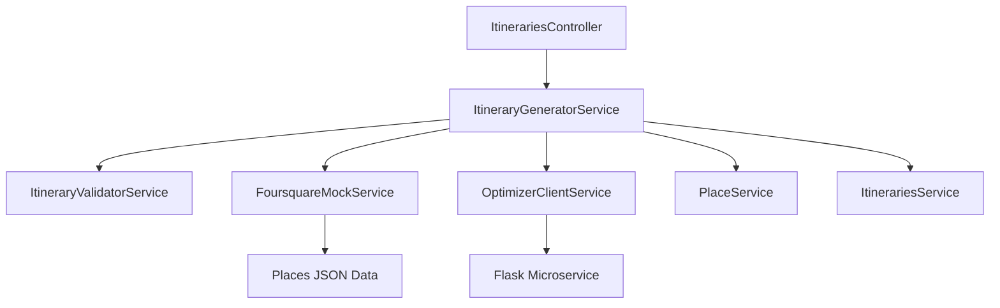
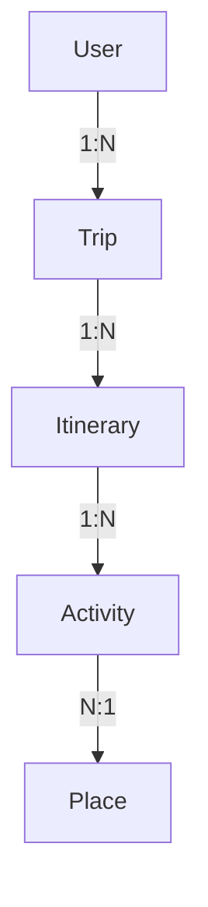

# 🚀 GUÍA COMPLETA: FLUJO DE GENERACIÓN DE ITINERARIOS
## RouteRite Backend - Sistema de Optimización de Itinerarios

### 📋 **ÍNDICE**
1. [Resumen Ejecutivo](#resumen-ejecutivo)
2. [Arquitectura del Sistema](#arquitectura-del-sistema)
3. [Flujo Detallado (7 Pasos)](#flujo-detallado)
4. [Responsabilidades por Clase](#responsabilidades-por-clase)
5. [Propiedades y Métodos Clave](#propiedades-y-metodos-clave)
6. [Manejo de Errores](#manejo-de-errores)
7. [Casos de Uso](#casos-de-uso)
8. [Modelos de Datos](#modelos-de-datos)

---

## 🎯 **RESUMEN EJECUTIVO**

El **Sistema de Generación de Itinerarios** es el corazón de RouteRite que convierte parámetros básicos de un itinerario (tiempo, presupuesto, ubicación, preferencias) en un plan optimizado de actividades.

### **🔥 Endpoint Principal**
```http
POST /itineraries/{id}/generate
Authorization: Bearer {jwt_token}
Content-Type: application/json

{
  "max_activities": 5,
  "search_radius": 10000,
  "min_rating": 6.5,
  "prioritize_quality": true,
  "balance_categories": true
}
```

### **⚡ Flujo en 30 Segundos**
1. **Valida** → Verifica permisos y configuración del itinerario
2. **Calcula** → Deriva parámetros de tiempo, presupuesto y actividades 
3. **Busca** → Obtiene lugares candidatos desde Foursquare
4. **Optimiza** → Envía a microservicio Flask para optimización
5. **Persiste** → Guarda resultados en BD con transacciones
6. **Responde** → Retorna itinerario completo estructurado

---

## 🏗️ **ARQUITECTURA DEL SISTEMA**

### **📦 Módulos Principales**

```
📁 itineraries/
├── 🎮 itineraries.controller.ts        # Punto de entrada HTTP
├── ⚙️ itineraries.service.ts          # CRUD de itinerarios  
├── 🧠 services/
│   ├── itinerary-generator.service.ts  # 🔥 CEREBRO DEL SISTEMA
│   └── itinerary-validator.service.ts  # ✅ Validaciones robustas
└── 📋 dto/
    ├── generate-itinerary.dto.ts       # Request parameters
    └── generation-response.dto.ts      # Structured response

📁 optimizer/
├── 🌐 optimizer-client.service.ts     # Cliente HTTP para Flask
└── 📦 optimizer.module.ts             # Configuración HTTP

📁 places/
├── 🏪 place.service.ts                # Gestión de lugares
├── 🎮 place.controller.ts             # API de lugares
└── 📦 places.module.ts               # Módulo de lugares

📁 shared/
├── 🔧 utils/
│   ├── time.utils.ts                  # Cálculos temporales
│   └── scoring.utils.ts               # Algoritmos de puntuación
└── 📋 constants/
    └── generation.constants.ts        # Constantes del sistema
```

### **🔗 Dependencias Entre Módulos**



---

## 🔄 **FLUJO DETALLADO (7 PASOS)**

### **🚪 ENTRY POINT: `POST /itineraries/{id}/generate`**

**Controller: `ItinerariesController.generateItinerary()`**
- ✅ Autentica usuario via JWT
- 📝 Valida parámetros con class-validator
- 🎯 Genera Request ID único para tracking
- 🚀 Delega a `ItineraryGeneratorService`

---

### **1️⃣ PASO 1: OBTENCIÓN Y VALIDACIÓN DE DATOS**
**Responsable: `ItineraryGeneratorService.getAndValidateData()`**

#### **🔍 Subprocesos:**
1. **Obtener Itinerario**: `getItineraryWithTrip(itineraryId)`
2. **Verificar Permisos**: `trip.user_id === userId`
3. **Validar Configuración**: `ItineraryValidatorService.validateConfigured()`
4. **Validar Parámetros**: `ItineraryValidatorService.validateParameters()`
5. **Validar Rango de Fechas**: `ItineraryValidatorService.validateDateInTripRange()`

#### **📋 Validaciones Específicas:**

**validateConfigured():**
```typescript
// Verifica campos obligatorios
✅ budget !== null
✅ date !== null  
✅ start_time !== null
✅ end_time !== null
✅ experience_type_ids !== null && !empty
✅ lat !== null
✅ lng !== null

// Si falta alguno → BadRequestException con missing_fields[]
```

**validateParameters():**
```typescript
// Validaciones de consistencia
✅ Tiempos: HH:MM format + end_time > start_time + duration >= 3h
✅ Presupuesto: budget > 0 + isNumber
✅ Coordenadas: lat [-90,90] + lng [-180,180]
✅ Experience Types: split(',') + trim + not empty
```

**validateDateInTripRange():**
```typescript
// Validación temporal
✅ itinerary.date >= trip.start_date
✅ itinerary.date <= trip.end_date
✅ Normalización de fechas (solo fecha, sin hora)
```

---

### **2️⃣ PASO 2: CÁLCULOS DERIVADOS**
**Responsable: `ItineraryGeneratorService.calculateDerivedParameters()`**

#### **⏱️ Cálculos Temporales:**
```typescript
// Duración disponible
durationMinutes = TimeUtils.calculateMinutesDifference(start_time, end_time)

// Límites de actividades basados en tiempo
maxActivitiesByTime = floor(durationMinutes / 90) // 90min = actividad mín
minActivitiesByTime = max(3, ceil(durationMinutes / 180)) // 180min = actividad ideal

// Límites finales
activities: {
  min: minActivitiesByTime,
  max: min(options.max_activities, maxActivitiesByTime),
  target: optimal_between_min_max
}
```

#### **💰 Cálculos de Presupuesto:**
```typescript
budget: {
  total: itinerary.budget,
  avg_per_activity: budget / targetActivities,
  max_per_activity: budget * 0.5 // Máximo 50% en una actividad
}
```

#### **🚗 Cálculos de Viaje:**
```typescript
travel: {
  max_travel_time_between: 30, // minutos máx entre actividades
  total_travel_time_budget: durationMinutes * 0.25 // 25% total para viajes
}
```

---

### **3️⃣ PASO 3: OBTENCIÓN DE LUGARES CANDIDATOS**
**Responsable: `ItineraryGeneratorService.obtainCandidatePlaces()`**

#### **🔍 Búsqueda en Foursquare:**
```typescript
// Parámetros de búsqueda
searchParams = {
  ll: `${lat},${lng}`,
  limit: 50,
  categoryIds: experience_type_ids[],
  minRating: 6.5,
  sortByRatingDesc: true
}

// Llamada al servicio
response = await foursquareMockService.placeSearchFiltered(searchParams)
rawPlaces = response.data.results
```

#### **⚙️ Procesamiento de Lugares:**
```typescript
// Para cada lugar raw:
processedPlace = {
  fsq_place_id: place.fsq_place_id,
  name: place.name,
  lat/lng: coordinates,
  category_id: primaryCategory.id,
  rating: place.rating,
  quality_score: ScoringUtils.calculateQualityScore(), // Algorithm
  estimated_duration: estimateDurationByCategory(), // Category-based
  estimated_cost: estimateCostByPriceAndCategory(), // Price + Category
  availability_score: place.hours?.open_now ? 1.0 : 0.3,
  distance_from_origin: ScoringUtils.calculateDistance() // Haversine
}
```

#### **🎯 Algoritmo de Scoring:**
```typescript
// Quality Score = Rating normalizado × Factor de confianza
quality_score = (rating/10) * (0.7 + 0.3 * min(total_ratings/100, 1))

// Filtros de calidad
✅ rating >= 6.5
✅ availability_score >= 0.3  
✅ coordinates valid
```

---

### **4️⃣ PASO 4: PREPARACIÓN DE PAYLOAD PARA FLASK**
**Responsable: `ItineraryGeneratorService.prepareOptimizationPayload()`**

#### **📦 Estructura del Payload:**
```typescript
optimizationPayload = {
  itinerary: {
    id: itinerary.id,
    date: itinerary.date,
    origin: { lat, lng },
    time_window: { start, end, duration_minutes },
    budget: total_budget,
    constraints: {
      time_window: { start, end, duration_minutes },
      activities: { min, max, target },
      budget: { total, avg_per_activity, max_per_activity },
      travel: { max_travel_time_between, total_travel_time_budget }
    },
    preferences: {
      experience_type_ids: string[],
      prioritize_quality: boolean,
      balance_categories: boolean
    }
  },
  candidate_places: ProcessedPlace[], // Array de 50 lugares máx
  metadata: {
    request_id: string,
    destination: trip.destination,
    travelers_count: trip.travelers_count,
    timestamp: ISO_string
  }
}
```

---

### **5️⃣ PASO 5: LLAMADA AL MICROSERVICIO FLASK**
**Responsable: `OptimizerClientService.optimizeItinerary()`**

#### **🌐 Configuración HTTP:**
```typescript
// Configuración robusta
timeout: 30000ms (30 segundos)
max_retries: 3
retry_strategy: exponential_backoff
headers: {
  'Content-Type': 'application/json',
  'X-Request-ID': request_id
}
```

#### **🔄 Retry Logic:**
```typescript
// Exponential backoff
retry_delays = [1s, 2s, 4s, max:10s]

// Manejo de errores específicos
ECONNREFUSED → ServiceUnavailableException
TimeoutError → "Tiempo agotado para optimización"
HTTP 4xx/5xx → Mapeo específico
```

#### **📨 Respuesta Esperada:**
```typescript
OptimizationResult = {
  success: boolean,
  optimized_activities?: [
    {
      sequence: number,
      place: { fsq_place_id, name, lat, lng, category_id, estimated_cost, estimated_duration },
      start_time: "HH:MM",
      end_time: "HH:MM", 
      budget_allocated: number,
      transportation_mode: "driving",
      transportation_duration: number,
      notes: string[]
    }
  ],
  solve_time_seconds?: number,
  algorithm_used?: "GENETIC_ALGORITHM" | "GREEDY" | "SIMULATED_ANNEALING",
  candidates_evaluated?: number,
  error?: { code, type, details }
}
```

---

### **6️⃣ PASO 6: PERSISTENCIA EN BASE DE DATOS**
**Responsable: `ItineraryGeneratorService.persistOptimizationResult()`**

#### **💾 Transacción Completa:**
```typescript
// 6.1 Iniciar transacción
transaction = await sequelize.transaction()

try {
  // 6.2 Guardar/actualizar lugares
  for (activity in optimized_activities) {
    place = await placeService.findOrCreatePlace(activity.place, transaction)
    placeMappings.set(activity.place.fsq_place_id, place.id)
  }
  
  // 6.3 Limpiar actividades existentes
  deletedCount = await Activity.destroy({ 
    where: { itinerary_id }, 
    transaction 
  })
  
  // 6.4 Crear nuevas actividades
  for (activity in optimized_activities) {
    await Activity.create({
      itinerary_id,
      name: activity.place.name,
      description: activity.place.description || '',
      start_time: activity.start_time,
      end_time: activity.end_time,
      lat: activity.place.lat,
      lng: activity.place.lng,
      distance_to_start: activity.distance_from_origin,
      budget: activity.budget_allocated,
      place: activity.place,  // JSON con datos completos del lugar
      place_id: placeMappings.get(activity.place.fsq_place_id), // Nueva relación con modelo Place
      sequence: activity.sequence, // Orden en el itinerario
      transportation_mode: activity.transportation_mode || 'driving',
      transportation_duration: activity.transportation_duration,
      notes: activity.notes.join('; ')
    }, { transaction })
  }
  
  // 6.5 Actualizar metadata del itinerario
  await Itinerary.update({
    is_generated: true, // Nuevo campo que indica generación automática
    cover_image: getCoverImageFromFirstActivity(),
    max_activities: options.max_activities, // Nuevo campo con el máximo de actividades
    generation_metadata: { // Nuevo campo con metadatos de la generación
      algorithm: optimizationResult.algorithm_used,
      solve_time_seconds: optimizationResult.solve_time_seconds,
      candidates_evaluated: optimizationResult.candidates_evaluated,
      generated_at: new Date().toISOString(),
      request_id
    }
  }, { where: { id: itinerary.id }, transaction })
  
  // 6.6 Commit
  await transaction.commit()
  
} catch (error) {
  await transaction.rollback()
  throw error
}
```

---

### **7️⃣ PASO 7: CONSTRUCCIÓN DE RESPUESTA**
**Responsable: `ItineraryGeneratorService.buildFinalResponse()`**

#### **🔄 Recarga con Relaciones:**
```typescript
// 7.1 Recargar itinerario completo
fullItinerary = await itinerariesService.getItineraryWithActivities(itineraryId)
// Incluye: itinerary + activities[] + activities[].place
```

#### **📋 Construcción de Response:**
```typescript
// 7.2 Mapeo a DTOs estructurados
GenerationResponseDto = {
  success: true,
  message: "Itinerario generado exitosamente",
  itinerary: {
    id, date, start_time, end_time, budget,
    activities: activities.map(activity => ({
      id: activity.id,
      name: activity.place?.name,
      fsq_place_id: activity.place?.fsq_place_id,
      estimated_duration: TimeUtils.calculateMinutesDifference(start, end),
      estimated_cost: activity.budget,
      order: activity.sequence,
      start_time: activity.start_time,
      end_time: activity.end_time,
      transportation_mode: activity.transportation_mode,
      notes: activity.notes
    })),
    summary: "Itinerario optimizado con X actividades..."
  },
  generation_info: {
    candidates_evaluated: optimizationResult.candidates_evaluated,
    solve_time_seconds: (Date.now() - startTime) / 1000,
    algorithm: optimizationResult.algorithm_used
  }
}
```

#### **📊 Logging de Éxito:**
```typescript
// 7.3 Log detallado para monitoreo
logger.log(`[${requestId}] SUCCESS - User: ${userId}, Itinerary: ${itineraryId}, Activities: ${activityCount}, SolveTime: ${solveTime}s`)
```

---

## 🏛️ **RESPONSABILIDADES POR CLASE**

### **🎮 ItinerariesController**
- **Propósito**: Punto de entrada HTTP y manejo de requests
- **Responsabilidades**:
  - Autenticación JWT
  - Validación de parámetros HTTP  
  - Mapeo de errores a códigos HTTP
  - Documentación Swagger
  - Request/Response logging

### **🧠 ItineraryGeneratorService** ⭐
- **Propósito**: Cerebro del sistema, orquesta todo el flujo
- **Responsabilidades**:
  - Coordinar los 7 pasos de generación
  - Manejo de transacciones de BD
  - Integración con servicios externos
  - Cálculos derivados complejos
  - Manejo de errores end-to-end

### **✅ ItineraryValidatorService**
- **Propósito**: Validaciones robustas y específicas
- **Responsabilidades**:
  - Validar configuración completa
  - Validar consistencia de parámetros
  - Validar rangos de fechas
  - Validaciones geográficas y temporales

### **🌐 OptimizerClientService**
- **Propósito**: Cliente HTTP robusto para Flask
- **Responsabilidades**:
  - Comunicación HTTP con retry logic
  - Timeout y error handling
  - Validación de respuestas Flask
  - Health check del microservicio

### **🏪 PlaceService**
- **Propósito**: Gestión de lugares y persistencia
- **Responsabilidades**:
  - CRUD de lugares (findOrCreate pattern)
  - Integración con transacciones
  - Mapeo fsq_place_id ↔ internal_id

### **📊 FoursquareMockService**
- **Propósito**: Proveedor de datos de lugares
- **Responsabilidades**:
  - Búsqueda filtrada de lugares
  - Detalles de lugares específicos
  - Caching de datos mock
  - Simulación de API real

---

## 🔧 **PROPIEDADES Y MÉTODOS CLAVE**

### **🔑 Propiedades Críticas**

#### **GenerateItineraryDto (Request)**
```typescript
max_activities: number     // [3-7] Actividades máximas
search_radius: number      // [1000-50000] Radio en metros  
min_rating: number         // [0-10] Rating mínimo
prioritize_quality: boolean // Priorizar calidad vs cantidad
balance_categories: boolean // Balancear tipos de experiencia
```

#### **ProcessedPlace (Internal)**
```typescript
fsq_place_id: string            // ID único de Foursquare
quality_score: number     // [0-1] Algoritmo de calidad
estimated_duration: number // Minutos estimados de visita
estimated_cost: number    // Costo estimado
distance_from_origin: number // Metros desde origen
```

#### **OptimizationConstraints (Flask Payload)**
```typescript
time_window: { start, end, duration_minutes }
activities: { min, max, target }  
budget: { total, avg_per_activity, max_per_activity }
travel: { max_travel_time_between, total_travel_time_budget }
```

### **⚙️ Métodos Esenciales**

#### **TimeUtils**
- `calculateMinutesDifference(start, end)` → Diferencia temporal en minutos
- `convertMinutesToTime(baseTime, offsetMinutes)` → Calcula nueva hora con offset en minutos
- `parseTimeToMinutes(time)` → Convierte formato HH:MM a minutos desde medianoche
- `formatMinutesToTime(minutes)` → Convierte minutos a formato HH:MM
- `validateTimeFormat(time)` → Validación formato HH:MM

#### **ScoringUtils** 
- `calculatePlaceScore(place, searchParams)` → Calcula score completo (0-100) basado en múltiples factores
- `estimateVisitDuration(place)` → Estima duración de visita según categoría y características 
- `estimateCost(place, travelersCount)` → Estima costo según categoría, precio y número de viajeros
- `calculateHaversineDistance(lat1, lng1, lat2, lng2)` → Cálculo preciso de distancia

---

## 🚨 **MANEJO DE ERRORES**

### **🎯 Estrategia de Errores**

#### **Por Fase del Proceso:**

**PASO 1 - Validación:**
- `NotFoundException` → Itinerario no encontrado  
- `ForbiddenException` → Sin permisos
- `BadRequestException` → Configuración incompleta/inválida

**PASO 3 - Búsqueda:**
- `UnprocessableEntityException` → Insuficientes lugares candidatos

**PASO 5 - Optimización:**
- `ServiceUnavailableException` → Flask no disponible
- `UnprocessableEntityException` → Optimización fallida

**PASO 6 - Persistencia:**
- `ServiceUnavailableException` → Error de BD
- Rollback automático de transacciones

#### **📋 Códigos de Error Específicos:**
```typescript
ERROR_CODES = {
  INSUFFICIENT_TIME: "Duración insuficiente",
  NO_FEASIBLE_SOLUTION: "Sin solución factible", 
  INSUFFICIENT_PLACES: "Pocos lugares encontrados",
  INVALID_PARAMETERS: "Parámetros inválidos",
  ITINERARY_NOT_CONFIGURED: "Configuración incompleta",
  GENERATION_FAILED: "Generación fallida"
}
```

#### **🔄 Retry & Fallback:**
```typescript
// Retry automático con exponential backoff
Flask calls: 3 intentos (1s, 2s, 4s)

// Fallback options para frontend
{
  manual_selection: true,           // Permitir selección manual
  retry_with_relaxed_params: true   // Sugerir parámetros relajados
}
```

---

## 🎭 **CASOS DE USO**

### **✅ Caso Exitoso**
```
Input: Itinerario válido + parámetros opcionales
Flow: 7 pasos completos
Output: Itinerario con 3-5 actividades optimizadas
Time: ~5-15 segundos
```

### **❌ Casos de Error Común**

#### **🔴 Configuración Incompleta**
```
Input: Itinerario sin budget/ubicación
Error: BadRequestException
Details: { missing_fields: ["budget", "lat", "lng"] }
Suggestion: "Completa la configuración del itinerario"
```

#### **🔴 Sin Lugares Suficientes**
```
Input: Zona rural + criterios muy restrictivos  
Error: UnprocessableEntityException
Details: "Encontrados 2 lugares, necesarios 3 mínimo"
Suggestions: ["Amplía radio de búsqueda", "Relaja criterios de rating"]
```

#### **🔴 Flask No Disponible**
```
Input: Payload válido pero Flask down
Error: ServiceUnavailableException  
Details: "Servicio de optimización temporalmente no disponible"
Retry: Automático con exponential backoff
Fallback: manual_selection = true
```

#### **🔴 Tiempo Insuficiente**
```
Input: Itinerario de solo 2 horas
Error: BadRequestException
Details: "La ventana de tiempo debe ser de al menos 3 horas"
Current: 2h, Required: 3h mínimo
```

### **🎯 Casos Límite**

#### **📍 Caso Óptimo**
```
- Ubicación urbana con muchos lugares
- Presupuesto generoso ($200+)
- Ventana amplia (8+ horas) 
- Múltiples categorías seleccionadas
→ Resultado: 5 actividades perfectamente optimizadas
```

#### **📍 Caso Desafiante**
```
- Ubicación remota
- Presupuesto limitado ($50)
- Ventana corta (3-4 horas)
- Categoría única muy específica
→ Resultado: 3 actividades básicas pero factibles
```

---

## 📊 **MODELOS DE DATOS**

### **🗃️ Principales Modelos**

#### **Itinerary (Nuevos Campos)**
```typescript
// Campos nuevos para generación automática
@AllowNull(true)
@Column(DataType.INTEGER)
declare max_activities: number; // Máximo de actividades para generación

@AllowNull(true)
@Default(false)
@Column(DataType.BOOLEAN)
declare is_generated: boolean; // Flag de itinerario generado automáticamente

@AllowNull(true)
@Column(DataType.JSON)
declare generation_metadata: object; // Metadatos del proceso de generación
```

#### **Activity (Nuevos Campos)**
```typescript
// Nuevos campos para actividades optimizadas


@AllowNull(true)
@Column(DataType.SMALLINT)
declare sequence: number; // Orden secuencial en el itinerario

@AllowNull(true)
@Column(DataType.STRING(50))
declare transportation_mode: string; // Modo de transporte a esta actividad

@AllowNull(true)
@Column(DataType.INTEGER)
declare transportation_duration: number; // Duración del transporte en minutos

@AllowNull(true)
@Column(DataType.TEXT)
declare notes: string; // Notas o tips sobre la actividad

// Nueva relación con el modelo Place
@BelongsTo(() => Place)
declare place: Place; // Relación con el lugar asociado
```

#### **Place (Nuevo Modelo)**
```typescript
// Modelo para persistencia de lugares
@Table({ tableName: 'places' })
export class Place extends Model {
  @PrimaryKey
  @AutoIncrement
  @Column(DataType.INTEGER)
  declare id: number;

  @AllowNull(false)
  @Column(DataType.STRING(255))
  declare name: string;

  @AllowNull(true)
  @Column(DataType.TEXT)
  declare description: string;

  @AllowNull(false)
  @Column(DataType.FLOAT)
  declare lat: number;

  @AllowNull(false)
  @Column(DataType.FLOAT)
  declare lng: number;

  @AllowNull(true)
  @Column(DataType.STRING(255))
  declare address: string;

  @AllowNull(true)
  @Column(DataType.STRING(50))
  declare fsq_place_id: string;

  @AllowNull(true)
  @Column(DataType.FLOAT)
  declare rating: number;

  @AllowNull(true)
  @Column(DataType.STRING(255))
  declare photo_url: string;

  @AllowNull(true)
  @Column(DataType.JSON)
  declare categories: object;

  @AllowNull(true)
  @Column(DataType.SMALLINT)
  declare price_level: number;

  declare activities: Activity[];
}
```

### **📊 Relaciones Principales**



### **🔄 Migraciones Incluidas**

```
📄 20251001000000-create-places-table.js
📄 20251001000001-add-generation-fields-to-itineraries.js
📄 20251001000002-add-place-relation-to-activities.js
```

### **⚙️ Constantes de Generación**

```typescript
// Límites de generación
export const GENERATION_LIMITS = {
  MIN_ACTIVITIES: 3,
  MAX_ACTIVITIES: 7,
  DEFAULT_ACTIVITIES: 5,
  MIN_SEARCH_RADIUS: 1000, // 1km
  MAX_SEARCH_RADIUS: 50000, // 50km
  DEFAULT_SEARCH_RADIUS: 10000, // 10km
  MIN_TIME_WINDOW_MINUTES: 180, // 3 horas
  MIN_RATING: 6.5,
};

// Restricciones de optimización
export const OPTIMIZATION_CONSTRAINTS = {
  MAX_TRAVEL_TIME_BETWEEN: 30, // minutos
  TOTAL_TRAVEL_TIME_BUDGET_RATIO: 0.25, // 25% del tiempo total
  MAX_COST_PER_ACTIVITY_RATIO: 0.5, // 50% del presupuesto total
  MIN_VISIT_DURATION: 45, // minutos mínimos por actividad
  MIN_PLACE_DISTANCE: 500, // metros para evitar clustering
};

// Pesos para scoring
export const SCORING_WEIGHTS = {
  RATING: 35,
  CATEGORY_RELEVANCE: 25,
  PROXIMITY: 20,
  POPULARITY: 10,
  PRICE_MATCH: 10,
};
```

---

## 🎉 **CONCLUSIÓN**

El **Sistema de Generación de Itinerarios** de RouteRite es una arquitectura robusta, modular y resiliente que transforma parámetros simples en experiencias de viaje optimizadas. 

### **🌟 Fortalezas Clave:**
- **Validación exhaustiva** en múltiples capas
- **Transacciones seguras** con rollback automático
- **Retry logic robusto** para servicios externos  
- **Error handling específico** con sugerencias accionables
- **Logging detallado** para debugging y monitoreo
- **Arquitectura modular** fácil de mantener y extender
- **Modelo de datos optimizado** con relaciones eficientes
- **Utilidades de tiempo y scoring** con algoritmos especializados

### **🚀 Próximos Pasos:**
- Integración con microservicio Flask real
- Optimizaciones de performance con caching
- Métricas y alertas de monitoreo avanzadas
- Evolución del algoritmo de scoring
- Implementación de análisis de datos históricos
